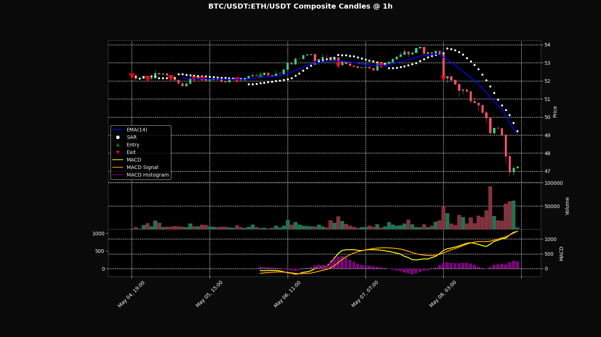

# Crypto Composite Instrument Analysis

#### What ?

This is a command line tool that generates composite instrument 
charts. Currently, it uses binance's API, but the point is to 
make this capable of working with decentralized exchanges as well. 
Eventually I hope to be able to do something like: 

<pre>
--evm --base arbitrum:0x2f2a2543B76A4166549F7aaB2e75Bef0aefC5B0f/0xaf88d065e77c8cC2239327C5EDb3A432268e5831 --quote base:0x63706e401c06ac8513145b7687A14804d17f814b/0x833589fCD6eDb6E08f4c7C32D4f71b54bdA02913
</pre>

(wbtc/usdc arbitrum vs aave/usdc base)

Theoretically, given the number of exchages ccxt supports, it should be simple to 
support many more major cex's. Not sure if ccxt is useful for dex's yet.

#### Why? 

Only elite traders will understand why this is such a useful trick.

#### How ? 

- install talib. there is a shell script for linux included. 
- install the rest of the dependencies.
- run:

<pre>
python3 ./main.py --base BTC/USDT --quote ETH/USDT --interval 1h 
</pre>

#### Did you find this helpful? 

<a href="ethereum://0x28722e44de90067f0Ea9C6aA7Fc09f465A70d9A6">
Then buy me a coffee: 0x28722e44de90067f0Ea9C6aA7Fc09f465A70d9A6
</a>

#### TODO:
- 05/11/2025, 02:45 am
  - finish implementing moralis api.
  - make sure it's robust enough
    - switch to aggregating onchain data if not